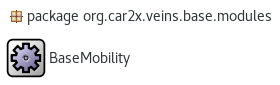
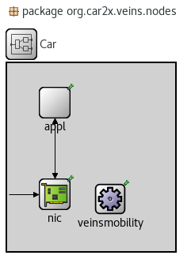
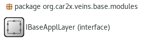
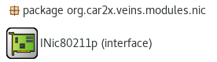
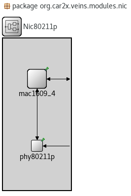
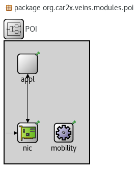
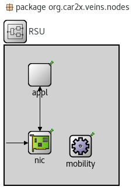
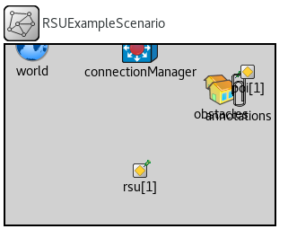
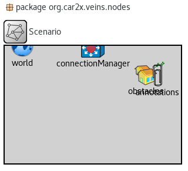
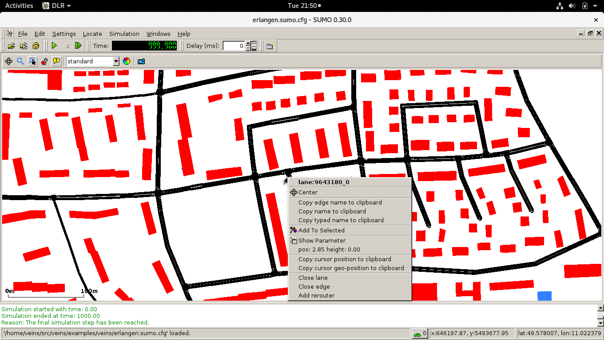

# <a name="top_of_page"></a>Notes
[Erlangen](#erlangen) , [Msg Files](#msg_files) , [NED Files](#ned_files) , [omnetpp.ini](#omnetpp_ini) , [SUMO](#sumo) , [TraCI](#traci) , [Veins](#veins)

```
+---+ Todo +---+
[ ] Find out how a message is sent from poi[0] to car[*]
[ ] Alter the msg to make it display something on the console.
```
---

# <a name="erlangen"></a>Erlangen
[Top](#top_of_page) , [erlangen.sumo.cfg](#erlangen_sumo_cfg) , [erlangen.rou.xml](#erlangen_rou_xml)

## <a name="erlangen_sumo_cfg"></a>erlangen.sumo.cfg
[Erlangen](#erlangen)

This is the configuration file for Erlangen in sumo. It should be pointed to when opening in SUMO. The filepath is:
```
~/src/veins/examples/veins/erlangen.sumo.cfg
```
To open the file in the SUMO GUI (*i.e. because you want to find edges to make a new route*), use the following command to run *SUMO-GUI* and point it the config file *erlangen.sumo.cfg*:
```
~/src/sumo-0.30.0/bin/sumo-gui -c ~/src/veins/examples/veins/erlangen.sumo.cfg
```
<!-- -->

## <a name="erlangen_rou_xml"></a>erlangen.rou.xml

[Erlangen](#erlangen) , [File Path](#erlangen_rou_xml.file_path) , [Structure](#erlangen_rou_xml.structure)

This xml file contains the routes used by SUMO to tell it's nodes what paths they should follow. 

>Quentin: I believe that this file is a good place to start. My first attempt will be to add another route and have VEINS reflect this change. 

#### <a name="erlangen_rou_xml.file_path"></a>File Path

```
~/src/veins/examples/veins/erlangen.rou.xml
```

><!> NOTE: There are two erlangen.rou.xml. The proper one to edit is the above. The incorrect one below is an auto-generated output file. <!>
```
~/src/veins/src/examples/veins/erlangen.rou.xml
```
[erlangen.rou.xml](#erlangen_rou_xml)

#### <a name="erlangen_rou_xml.structure"></a>Structure

```
<?xml version="1.0"?>
<!-- 
	Quick description of the file.
	Credits to Christoph Sommer.
	Liscence Info. 
 -->
 <routes
	<vType .../>
	<route .../>
	<flow  .../>
 /> 
```

*vType* handles vehicle information. If we want to create more varieties of vehicles we should add more *vType*.

*route* is a very simple data structure. It has an id and has edges, which is a series of connected edges seperated by a single space. 

*flow* requires a *vType* and a *route*. It handles the frequency, quanity, and type of nodes to be spawned for a given *route*. By default, the simulation runs with 194 vehicles. The amount of vehicles can be modifed by editing the attribute *number*.

```
<flow . . . number=""/>
```
[erlangen.rou.xml](#erlangen_rou_xml)

----

## <a name="msg_files"></a>Msg files

The directory for message files in veins is:
```
~/src/veins/src/veins/base/messages/
```

OMnet++ automatically generages the .cc and .h files for msg files. The usefull information will always be found in the .msg files.

[Top](#top_of_page)


---

## <a name="ned_files"></a>NED files

[Top](#top_of_page) , [BaseMobility.ned](#basemobility_ned) , [Car.ned](#car_ned) , [IBaseApplLayer.ned](#ibaseappllayer_ned) , [INic80211p.ned](#inic80211p_ned) , [Nic80211p.ned](#nic80211p_ned) , [poi.ned](#poi_ned) , [RSU.ned](#rsu_ned) , [RSUExampleScenario.ned](#rsuexamplescenario_ned) , [Scenario.ned](#scenario_ned)

#### <a name="basemobility_ned"></a>BaseMobility.ned

```
~/src/veins/src/veins/base/modules/BaseMobility.ned
```
Base Mobility gives a  node a static position in the world. It is part of package:
```
modules
```
If you want to give your nodes a static 2d position in the world, then add a submodule like:
```
mobility : BaseMobility {
	parameters:
		@display("i=block/cogwheel");
}
```

[NED Files](#ned_files)

<!-- -->

#### <a name="car_ned"></a>Car.ned

```
~/src/veins/src/veins/nodes/Car.ned
```
This .ned are the car nodes. The car nodes appear to be similiar to the RSU in that their connections are similiar and except for the mobility submodule is <veinsmobilityType> instead of BaseMobility.

It imports:
```
IBaseApplLayer.ned
IMobility.ned
Nic80211p.ned
```

Creates three (3) submodules:
```
appl : <appltype> like org.car2x.veins.base.modules.IBaseApplLayer
nic : <nicType> like org.car2x.veins.modules.nic.INic80211p
veinsmobility : <veinsmobilityType> like org.car2x.veins.base.modules.IMobility
```	

Has the following connections:
```
nic.upperLayer <--> appl.lowerLayer
nic.upperContro <--> appl.lowerControl
veinsradioIn --> nic.radioIn
```
[NED Files](#ned_files) , [Nic80211p.ned](#nic80211p_ned)

<!-- begin IBaseApplLayer.ned -->

#### <a name="ibaseappllayer_ned"></a>IBaseApplLayer.ned

```
~/src/veins/src/veins/base/modules/IBaseApplLayer.ned
```

IBaseApplLayer.ned is an interface for adding application level features to a node.

<!-- end IBaseApplLayer.ned -->
<!-- begin INic80211p.ned -->

#### <a name="inic80211p_ned"></a>INic80211p.ned

```
~/src/vins/src/veins/modules/nic/INic80211p.ned
```
INic80211p.ned is a simple interface with I/O gates for NICs.

[NED Files](#ned_files)

<!-- end INic80211p.ned -->
<!-- begin nic80211p.ned -->

#### <a name="nic80211p_ned">Nic80211p.ned

```
~/src/veins/src/veins/modules/nic/Nic80211p.ned
```
>Quentin: We should *not* be editing this file.

Nic80211p.ned serves as a network interface card on the network layer.

It imports:
```
PhyLayer80211p.ned
Mac1609_4.ned
```

Like (uses the Interface):
```
INic80211p.ned
```

Creates two (2) submodules:
```
phy80211p : PhyLayer80211p
mac1609_4 : Mac1609_4
```

Has the following connections:
```
radioIn --> phy80211p.radioIn;

mac1609_4.lowerControlOut --> phy80211p.upperControlIn;
mac1609_4.lowerLayerOut --> phy80211p.upperLayerIn;
phy80211p.upperLayerOut --> mac1609_4.lowerLayerIn;
phy80211p.upperControlOut --> mac1609_4.lowerControlIn;

mac1609_4.upperControlIn <-- upperControlIn
mac1609_4.upperLayerIn <-- upperLayerIn

mac1609_4.upperLayerOut --> upperLayerOut
mac1609_4.upperControlOut --> upperControlOut
```
[NED Files](#ned_files) , [INic80211p.ned](#inic80211p_ned)

<!-- end nic80211p.ned -->
<!-- begin poi.ned -->

#### <a name="poi_ned"></a>poi.ned

```
~/src/veins/src/veins/modules/poi/poi.ned
```
>Quentin: This node is created by me. It is a work in progress.

This is the .ned file for our Point of Interest nodes, created by Quentin -- The progress of this node is shown below:

```
+------+ Progress +------+

[X] Act as a visual Point of Interest.
[X] Be placed somewhere in the world.
[ ] Send a packet to a vehicle.
[ ] Retrieve a packet from a vehicle.
[ ] Limit communication to vehicles in a specific radius.
[ ] Store an "incentive weight" in a variable.
[ ] Decrease "incentive weight" when a vehicle comes by.
[ ] Increase "incentive weight" over time.
```

It imports:
```
BaseMobility.ned
IBaseApplLayer.ned
Nic80211p.ned
```

Creates one (1) submodule:
```
appl : <applType> like org.car2x.veins.base.modules.IBaseApplLayer {...}
nic : <nicType> like org.car2x.veins.modules.nic.INic80211p
mobility : BaseMobility {...}
```

[NED Files](#ned_files) , [BaseMobility.ned](#basemobility_ned) , [Nic80211p.ned](#nic80211p_ned)

<!-- end poi.ned -->
<!-- begin RSU.ned -->

#### <a name="rsu_ned"></a>RSU.ned

```
~/src/veins/src/veins/nodes/RSU.ned
```

This .ned appears to handle communication between the Network Interface Card (NIC) and the application layer. 

It imports:
```
BaseMobility.ned
IBaseApplLayer.ned
Nic80211p.ned
```
Creates three (3) submodules:
```
appl : <applType> like org.car2x.veins.base.modules.IBaseApplLayer
nic : <nicType> like org.car2x.veins.modules.nuc.INic80211p
mobility : BaseMobility
```
	
Has the following connections:
```
nic.upperLayer <--> appl.lowerLayer
nic.upperContro <--> appl.lowerControl
veinsradioIn --> nic.radioIn
```	
[NED Files](#ned_files) , [Nic80211p.ned](#nic80211p_ned)

<!-- end RSU.ned -->
<!-- begin RSUExampleScenario.ned -->

#### <a name="rsuexamplescenario_ned"></a>RSUExampleScenario.ned

```
~/src/veins/examples/veins/RSUExampleScenario.ned
```
This appears to be the .ned file for the veins example.

It imports:
```
RSU.ned
Scenario.ned
poi.ned //<-- Added by Quentin
```

This .ned creates two submodules:
```
rsu[1]: RSU {...}
poi[1]: poi {...} //<-- Added by Quentin
```

[NED Files](#ned_files) , [poi.ned](#poi_ned) , [RSU.ned](#rsu_ned) , [Scenario.ned](#scenario_ned)

<!-- end RSUExampleScenario.ned -->
<!-- begin Scenario.ned -->

#### <a name="scenario_ned"></a>Scenario.ned

```
~/src/veins/src/veins/nodes/Scenario.ned
```

This .ned handles the visual objects in the world and also acts as a manager for the TraCIScenario.

It imports:
```
ConnectionManager.ned
BaseWorldUtility.ned
TracCIScenarioManagerLanchd.ned
ObstacleControl.ned
AnnotationManager.ned
```	

Creates five (5) submodules:
```
obstacles
annotations
connectionManager
world - parameters for playgroundSize X,Y,Z
manager
```	

Has no connections.

[NED Files](#ned_files)

<!-- -->

---

## <a name="omnetpp_ini"></a>omnetpp.ini

[Top](#top_of_page) , [BaseMobility configuration](#omnetpp_ini.baseMobility_configuration) , [Application Layer configuration](#omnetpp_ini.application_layer_configuration)

```
~/src/veins/examples/veins/omnetpp.ini
```

This is the configuration file for the [RSUExampleScenario](#rsuexamplescenario_ned). Sections that were added by us are as follows:
```
POI Settings
```
<!-- begin Application Layer Configuration -->

#### <a name="omnetpp_ini.application_layer_configuration"></a>Application Layer configuration

When adding an applType as a submodule, one must specify which applType template they are going to use. The templates are found in the [TraCI](#traci) folder.
Aftre we choose a template to use we must point our nodes to the appltype:
```
*.poi[*].applType = "MyVeinsApp" # <-- uses the TraCI template

 >> or <<

*.rsu[*].applType = "TraCIDemoRSU11p" # <-- The default sample we start with.
```

Additionally, we may change some of the application layer settings from their default settings here, as is the case with the *rsu* node example:
```
*.rsu[*].appl.headerLength = 80bit
*.rsu[*].appl.sendBeacons = true
*.rsu[*].appl.dataOnSch = false
*.rsu[*].appl.beaconInterval = 1s
*.rsu[*].appl.beaconUserPriority = 7
*.rsu[*].appl.dataUserPriority = 5
```

[omnetpp.ini](#omnetpp_ini) , [IBaseApplLayer.ned](#ibaseappllayer_ned) , [TraCI](#traci)
<!-- end Application Layer Configuration -->
<!-- begin BaseMobility configuration -->

#### <a name="omnetpp_ini.baseMobility_configuration"></a>BaseMobility configuration
When assigning BaseMobility as a submodule to a node, one must specify an *x*, *y*, and *z* position. This is done in the configuration file.
```
#### Sample Assignment ####
*.poi[0].mobility.x = 1950
*.poi[0].mobility.y = 1500
*.poi[0].mobility.z = 3 # <-- ??? Unsure about z position for now.

#### Magnitude #####
+---------> 
|      x goes from LEFT to RIGHT.
|
|
| y goes from TOP to BOTTOM.
V
```
<!-- end BaseMobility configuration -->

[omnetpp.ini](#omnetpp_ini) , [BaseMobility.ned](#basemobility_ned)

---

## <a name="sumo"></a>SUMO
The directory for SUMO is:
```
~/src/sumo-0.30.0/
```
The filepath for the SUMO GUI is at:
```
~/src/sumo-0.30.0/bin/sumo-gui
```
[Top](#top_of_page)

----

## <a name="traci"></a>TraCI
[Top](#top_of_page) , [TraCIDemo11p](#traci.tracidemo11p)

TraCI handles the communication within/between nodes. The directory for the TraCI folder is:
```
~/src/veins/src/modules/application/traci/
```
TraCI is an important player in the application layer, which the layer that we will be performing most of our work on. Some notable modules are:
```
     MyVeinsApp <-- A template for application layer modules
TraCIDemoRSU11p <-- Tutorial RSU node
   TraCIDemo11p <-- Tutorial Car nodes (node[*])
ChangeRouteTest <-- Quentin's attempt to change car route
```

<!-- begin TraCIDemo11p -->

#### <a name="traci.tracidemo11p"></a>TraCIDemo11p
TraCIDemo11p is the application type module for the car nodes. It consists of three (3) files:
```
TraCIDemo11p.ned
TraCIDemo11p.h
TraCIDemo11p.cc
```
Notably in the *initialize* function we see:
```
//set destination Coordinates here
lastCoord = Coord(49.578099,11.022388);

//new route set in doubly linked list below
routeNode.push_back("9643180");
```
The numbers **49.579099** and **11.022388** are *Latitude* and *Longitude* coordinates respectively from the Erlangen map. The number **9643180** appears to be an edge on the map nearby the coordinates.
<br/>


[TraCI](#traci) , [Erlangen](#erlangen)

<!-- end TraCIDemo11p -->

---

## <a name="veins"></a>Veins
The directory for veins is:
```
~/src/veins/
```
[Top](#top_of_page)

---

End of file.

[Top](#top_of_page)
