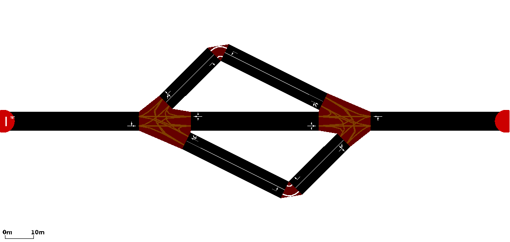
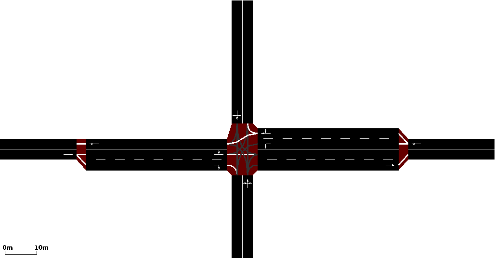
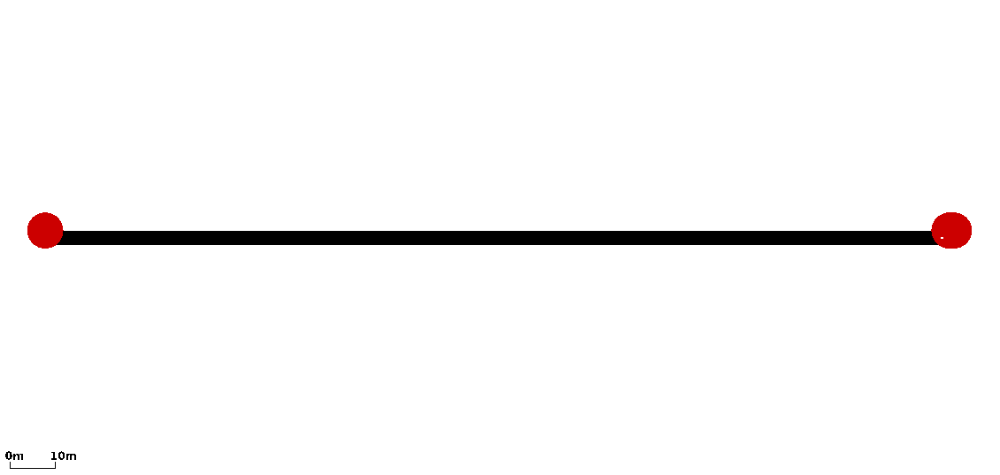

# <a name="top_of_page"></a>SUMO + TraCI
[Projects](#projects) , [SUMO Essentials](#sumo_essentials)
>Quentin: This readme contains notes about our with with SUMO + TraCI.
>
>[Master readme](../Readme.md) , [Veins Omnet++ SUMO TraCI readme](../veins_master/Readme.md)

---

## <a name="projects"></a>Projects
[Top](#top_of_page) , [3choices](#projects.3choices) , [intersection_1](#projects.intersection_1) , [my_first_project](#projects.my_first_project)

<!-- begin 3choices -->
### <a name="projects.3choices"></a>3choices


<br/>
Like the namesake of the project, there are three routes that a vehicle may take to get from the left to the right -- these choices are *top*, *middle*, or *bottom*.

>Quentin: This project is currently under construction.
```
+---+ TODO +---+
[ ] Point python to the TraCI libraries.
[ ] Load the project without any errors.
[ ] Create a vehicle type.
[ ] Create a route. Call it "middle".
[ ] Assign "middle" to a vehicle.
[ ] Create a second route. Call it "top."
[ ] Assign "top" to a second vehicle.
[ ] Create a third route. Call it "bottom."
[ ] Assign "bottom" to a third vehicle.
```

[Projects](#projects)
<!-- end 3choices -->

<!-- begin intersection_1 -->
### <a name="projects.intersection_1"></a>intersection_1
>Quentin: This project started out following the SUMO tutorial [quick start](http://sumo.dlr.de/wiki/Tutorials/quick_start) however, I ended up making my own map instead and learning how to use *netedit* that way.


<br/>
This is the interesection of Rockridge Rd & US Hwy 98 N created usign *netedit*. It is a simple example of how edges, lanes and junctions fit together and also a good reference for learning to use *netedit*.

[Projects](#projects) , [netedit](#sumo_essentials.tools.netedit)
<!-- end intersection_1 -->

<!-- begin my_first_project -->
### <a name="projects.my_first_project"></a>my_first_project
>Quentin: This is the first project I created. It follows very closely to the SUMO tutorial [Hello Sumo](http://sumo.dlr.de/wiki/Tutorials/Hello_Sumo).


<br/>
It is a straight line with a single vehicle that moves from one end to the other. This project is a clean simple example of the SUMO essentials.

[Projects](#projects) , [SUMO essentials](#sumo_essentials)
<!-- end my_first_project -->

---

## <a name="sumo_essentials"></a>SUMO Essentials
[Top](#top_of_page) , [Essential Files](#sumo_essentials.essential_files) , [Tools](#sumo_essentials.tools)

<!-- Begin Essential Files -->
### <a name="sumo_essentials.essential_files"></a>Essential Files
[Sumo Essentials](#sumo_essentials) , [*.net.xml](#sumo_essentials.essential_files.net_xml) , [*.rou.xml](#sumo_essentials.essential_files.rou_xml) , [*.settings.xml](#sumo_essentials.essential_files.settings_xml) , [*.sumoconfig](#sumo_essentials.essential_files.sumoconfig)

Every SUMO project must have a few essential Files.
```
1. *.net.xml <-- Contains the map. Generated by netconvert or netedit.
2. *.rou.xml <-- Contains the routes and vehicles.
3. *.sumoconfig <-- Points SUMO to the neccesary files.
4. *.settings.xml <-- (optional) Settings defined for the SUMO-GUI.
```

<!-- begin *.net.xml -->
#### <a name="sumo_essentials.essential_files.net_xml">*.net.xml
The **\*.net.xml** contains all of the neccesary nodes, edges, junctions, intersections etc. that make up the map. This file is generated by combining a **\*.nod.xml** and a **\*.edg.xml** together using netconvert, or automatically when using netedit to create a map.
These files are always auto-generated (i.e. by *netconvert* or *netedit*).

[Essential Files](#sumo_essentials.essential_files) , [netconvert](#sumo_essentials.tools.netconvert) , [netedit](#sumo_essentials.tools.netedit)
<!-- end *.net.xml -->
<!-- being *.rou.xml -->
#### <a name="sumo_essentials.essential_files.rou_xml"></a>*.rou.xml
By convention, these files have the extension **.rou.xml** but are recoginzed by the tag **\<routes\>** within the file. The basic structure of a **\*.rou.xml** file looks like:
```
<routes>
	<vType ... />
	^ One or more vehicle types.
	
	<route ... />
	^ One or more routes.
	
	<vehicle ... />
	  or
	<flow .../>
	^ Either a <vehicle> or <flow> to link the <vType> and <route> together.
</routes>
```
[Essential Files](#sumo_essentials.essential_files)
<!-- end *.rou.xml -->
<!-- begin *.settings.xml -->
#### <a name="sumo_essentials.essential_files.settings_xml"></a>*.settings.xml
By convention, *sumo-gui* configuration files are named with the **.settings.xml** extension. This file is used along with the **\*.sumoconfig** file to define settings for a graphical SUMO simulation. Below we look the graphical configuration file for *my_first_project*.
```
<viewsettings>
	<viewport y="0" x="100" zoom="100" /> <-- Where the visible area begins whent he simulation starts.
	<delay value="100" /> <-- The time between steps. (50+ is reccomended.)
</viewsettings>
```

[Essential Files](#sumo_essentials.essential_files) , [*.sumoconfig](#sumo_essentials.essential_files.sumoconfig)
<!-- end *.settings.xml -->
<!-- begin *.sumoconfig -->
#### <a name="sumo_essentials.essential_files.sumoconfig"></a>*.sumoconfig
By convention, the SUMO configuration files are named with the **.sumoconfig** extension but are recognized by the tag **\<configuration\>** within the file. This file is an XML file with pointers to other essential files and settings for running the simulation without the graphical user interface. Below we look a the coniguration file for *my_first_project*.
```
<configuration>
	<input>
		<net-file value="mfp.net.xml" /> <-- The map.
		<route-files value="mfp.rou.xml /> <--- The route the cars travel.
		<gui-settings-file value="mfp.settings.xml" /> <-- Settings for sumo-gui
	</input>
	^ We must point to the critical files here.
	
	<time>
		<begin value="0" /> <-- Start time of the simulation.
		<end value="10000" /> <-- end time of the simulation.
	</time>
</configuration>
```
[Essential Files](#sumo_config.essential_files) , [*.net.xml](#sumo_essentials.essential_files.net_xml) , [*.rou.xml](#sumo_essentials.essential_files.rou_xml) , [*.settings.xml](#sumo_essentials.essential_files.settings_xml)
<!-- end *.sumoconfig -->
<!-- End Essential Files -->

<!-- Begin tools -->
### <a name="sumo_essentials.tools"></a>Tools
[Sumo Essentials](#sumo_essentials) , [netconvert](#sumo_essentials.tools.netconvert) , [netedit](#sumo_essentials.tools.netedit) , [sumo-gui](#sumo_essentials.tools.sumo_gui)

This section covers the various tools that are provided by the SUMO software.

<!-- Begin netconvert -->
#### <a name="sumo_essentials.tools.netconvert"></a>netconvert

>Quentin: The official documentation for *netconvert* can be found on the [NETCONVERT page](http://sumo.dlr.de/wiki/NETCONVERT) of the [SUMO wiki](http://sumo.dlr.de/wiki/Simulation_of_Urban_MObility_-_Wiki).

The purpose of *netconvert* is the create **\*.net.xml** files, which are the map files SUMO uses for it's simulations.

The filepath for *netconvert* is:
```
~/src/sumo-0.30.0/bin/netconvert
```
Additionally, *netconvert* may be called from anywhere in the command line by using:
```
netconvert
```
Below is an example of how we created the *mfp.net.xml* file in the *my_first_project* project.
```
netconvert --node-files=mfp.nod.xml --edge-files=mfp.edg.xml --output-file=mfp.net.xml
```

[Tools](#sumo_essentials.tools)
<!-- End netconvert -->
<!-- begin netedit -->
#### <a name="sumo_essentials.tools.netedit"></a>netedit
>Quentin: The official documention for *netedit* can be found on the [NETEDIT page](http://sumo.dlr.de/wiki/NETEDIT) of the [SUMO wiki](http://sumo.dlr.de/wiki/Simulation_of_Urban_MObility_-_Wiki).

*netedit* is a graphical map creator for SUMO. It's user interface shares much of the same functionality and shortcuts of *sumo-gui*. *Netconvert* is incorporated into *netedit*. By convention, *netedit* files should be saved with the extension of **.net.xml**.

The filepath for *netedit* is:
```
~/src/sumo-0.30.0/bin/netedit
```
Additionally, *netedit* may be called from anywhere in the command line by using:
```
netedit
```
When opening a map in *netedit* from the command line, point it to the **\*.net.xml** file like below when used to open **intersection_1.net.xml**:
```
netedit interesection_1.net.xml
```

[Tools](#sumo_essentials.tools)
<!-- end netedit -->
<!-- begin sumo-gui -->
#### <a name="sumo_essentials.tools.sumo_gui"></a>sumo-gui
*sumo-gui* is the grahical user interface used for running SUMO simulations. It shares much of the same functionality and shortcuts of *netedit*.

The filepath for *sumo-gui* is:
```
~/src/sumo-0.30.0/bin/sumo-gui
```
Additionally, *sumo-gui* may be called from anywhere in the command line by using:
```
sumo-gui
```
We can open any SUMO simulation directly from the command line by pointing *sumo-gui* to the **\*.sumoconfig** file with the **-c** flag as in the example below where we open *my_first_project*.
```
sumo-gui -c mfp.sumoconfig
```

[Tools](#sumo_essentials.tools)
<!-- end sumo-gui -->

<!-- End tools -->
---
