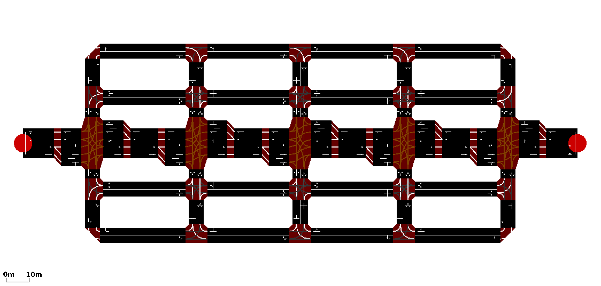
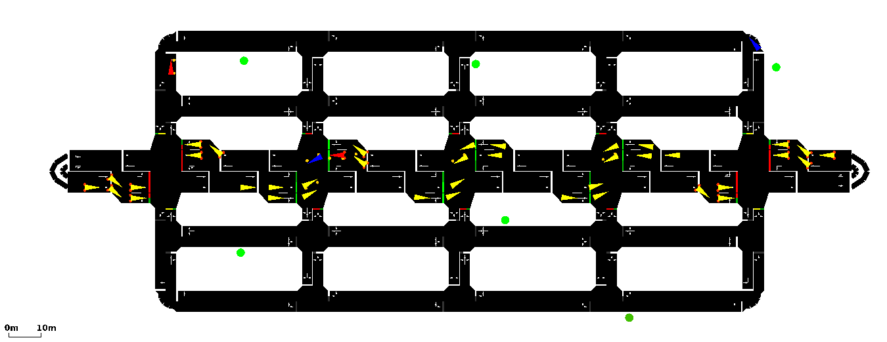
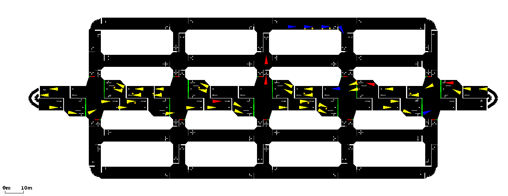

# <a name="top_of_page"></a>grid2
>Quentin: Here we have notes about the project grid2
>
>[Projects Home](../Readme.md)



A more ergonomic adaptation of [grid](../grid/Readme.md) that fits neatly on a 1366x768 resolution monitor. The map features a rectangular city with rectangular blocks. There is a four-lane high that goes through the center with the highest priority. The outer roads have the second highest priority and the inside streets have the lowest.

---
<!-- begin poi1 -->
## <a name="poi1"></a>poi1
[Top](#top_of_page) , [Step #1](#poi1.step1) , [Step #2](#poi1.step2) , [Step #3](#poi1.step3) , [Step #4](#poi1.step4) , [Bug Fixes](#poi1.bug_fixes)
<br/>

<br/> The project *poi1* is the second example created on the *grid2* project.
We build off of the previous example [reroute1](#reroute1) and we utilize the *poi* class from the [poi module](../../../modules/Readme.md). We have the following goals:
1. Add any number of point of interests (POIs).
2. Route vehicles to the POIs at random.
3. Increase POI value over time.
4. Decrease POI value when a vehicle arrives to the closest point near the POI.

### <a name="poi1.step1"></a>Step #1: Adding point of interests (POIs).
The first step is to add the POIs to the map.
TraCI has has a module for POIs and we'll use this as a baseline for the handling or POIs.

We want to choose where our POIs will be so we'll define the x and y coordinates of any poi we want to add in *config.py*.
From left to right, each pair of coordinates represent one POI and have the IDs *poi0, poi1... poin* for up to *n* amount of POIs -- we use a list so we may define any amount of POIs from 0 to *n* POIs.
```
# File: config.py

#[x,y] coordinates of all POI.
llf_poi_coords = [[23.0,-25.0],[24.0,34.0],[95.0,33.0],[104.0,-15.0],[142.0,-45.0],[187.0,32.0]] 
```

Before we start looping through our list off coordinates to create our POIs with, we'll bring in a global variable *L_POIS* which we'll use to keep track of and manipulate POIs within the python script.
At each step of our POI creation loop, we'll add POIs to the simulation with the *traci.poi.add()* method and find the nearest edge with the *traci.simulation.convertRoad()* method.
Then we'll create a [poi object](../../../modules/Readme.md) and add it to *L_POIS*.
```
global L_POIS
for lf_poi in config.llf_poi_coords:
	s_poi_id = "poi" + str(n_pois)
    
	# traci.poi.add( ID, x, y, Color, arbitrary desc., layer) 
	traci.poi.add(s_poi_id, lf_poi[0], lf_poi[1], (100,100,100,0), poiType="taco_cart",layer=0)
    
	# Finds the closest edge to an xy coordinate.
	# (edgeID, closest_edge_x, closest_edge_y)
	s_sff_road = traci.simulation.convertRoad(lf_poi[0],lf_poi[1],isGeo=False)

	# Create a POI object
	o_poi = poi.poi(s_poi_id,lf_poi[0],lf_poi[1], config.f_initial_poi_value, s_sff_road)

	# Set Decrement Amount
	# This is will be the amount the Value will decrease every POI Update
	o_poi.setDecreaseValue(config.f_poi_value_dec_amt) 

	# Add the object to the list of POIs.
	L_POIS.append(o_poi)

	n_pois += 1
# end for lf_poi in config.llf_poi_coords:
```

### <a name="poi1.step2"></a>Step #2: Route vehicles to POIs at random.
The next step is to route some vehicles to the POIs at random.
To do this we add a few lines of code in the *go_downtown(n_step)* method that sends the vehicle to the edge closest to a random POI.

```
# Send it to a poi node downtown at random
global L_POIS
n_random_int = random.randint(0,len(L_POIS)-1)
s_dest_edge = L_POIS[n_random_int].getClosestEdge()[0]
traci.vehicle.changeTarget(s_veh_id,s_dest_edge)
```

### <a name="poi1.step3"></a>Step #3: Update POIs every tick.
We update the POIs at a configurable tick rate (**config.n_poi_value_update_rate**).
Within the update loop, we increase each POIs value and update the color to represent the next value.
All POIs start out as grey on timestep 0 and range between red (lowest value) and green (highest value) for the remainder of the simulation.

```
if (n_step % config.n_poi_value_update_rate == 0):
	global L_POIS
	for poi in L_POIS:
		# Value increases over time
		poi.increaseValueBy(config.f_poi_value_inc_amt)
		
		# Make sure that the value can't increase over max
		if (poi.getValue() > config.f_poi_value_max):
			poi.setValue(config.f_poi_value_max)
	  
		# Update color to reflect value
		# We want low values to be blue and high values to be green
		# Colors are (red, green, blue, alpha)
		n_color_intensity = int((poi.getValue() / config.f_poi_value_max) * 255)
		if (poi.getValue() < 0):
			traci.poi.setColor(poi.getID(),(255,0,0,0))
		elif (poi.getValue() > 255):
			traci.poi.setColor(poi.getID(),(0,255,0,0))
		else:
		traci.poi.setColor(poi.getID(),(255-n_color_intensity,0+n_color_intensity,0,0))
```

### <a name="poi1.step4"></a>Step #4: Decrease POI value on hit.
Finally, when a vehicle gets to it's destination POI, we call it a "hit".
Since POIs may be placed outside of the boundaries of an edge, we accept a vehicle arriving on the edge closest to the POI to be equivalent to arriving at the POI.
We add a few lines to the *handle_lls_veh_data()* method to locate and properly call a hit to the corresponding POI.

```
# Locate the POI that we arrived at. Find the POI that is 
# nearest to the edge we're on.
for poi in L_POIS:
	if (s_dest_edge == poi.getClosestEdge()[0]):    
		poi.vehicleHit(n_step,s_veh_id)
		break
```

### <a name="poi1.bug_fixes"></a>Bug Fixes
In this example we fixed a bug in the *go_downtown(n_step)* method that caused vehicles to disappear after reaching their POI destination when they are flagged for rerouting twice or more.

First, we change the way that a vehicles route "memory" is stored into the *LLS_VEH_DATA* data structure.
Before we add a new item **[** vehicle id **,** destination edge ID **,** exit ID **]** we clean any deprecated routes.
```
# Add it to LLS_VEH_DATA to be tracked.
# If a record already exists remove it so we can update   
for ls_row in LLS_VEH_DATA:
	if (s_veh_id == ls_row[0]):
		LLS_VEH_DATA.remove(ls_row)
		
# Add to history.
LLS_VEH_DATA.append([s_veh_id,s_exit_edge,s_dest_edge])
```

We also added some checks when defining our exit edges. 
If a vehicle has been rerouted, there is no reason to redefine it's exit destination.
```
# Store the exit destination edge before we change it's route.
# In case the same vehicle gets rerouted, we'll make sure that
# it doesn't set it's exit edge to a non-exit
global LLS_VEH_DATA 
ls_exit_edges = ["gneE52","-gneE52","gneE50","-gneE50"]
s_edge = traci.vehicle.getRoute(s_veh_id)[-1]

# It's being rerouted for the 1st time.
if (s_edge in ls_exit_edges):
	s_exit_edge = s_edge
	
# It's being rerouted for the 2nd or more time.
else:
	for ls_row in LLS_VEH_DATA:
		if (s_veh_id == ls_row[0]):
s_exit_edge = ls_row[1]
```

<!-- end poi1 -->
---
<!-- begin reroute1 -->
## <a name="reroute1"></a>reroute1
[Top](#top_of_page) , [Step #1](#reroute1.step1) , [Step #2](#reroute1.step2) , [Step #3](#reroute1.step3) , [Step #4](#reroute1.step4)
<br/>

<br/>The project *reroute1* is the first example created on the *grid2* project. Here we have two goals:
1. Add lots of traffic that flows **east -> west** and **west -> east** along the four-lane highway through town.
2. Send some vehicles downtown and then once they arrive, send them back to their original destination.

### <a name="reroute1.step1"></a>Step #1: Create some traffic.
The first step is to create a natural flow of traffic moving through our city. To create this flow we use a uniform distribution between 0.0 and 1.0 so that half of the vehicles created are routed eastbound and the other half of vehicles are routed westbound.

```
# We want half of the vehicles to travel eastbound and half
# To travel westbound.
if (random.uniform(0.0,1.0) > 0.5):
	traci.vehicle.add(s_vehicle_id, "eastbound", depart=n_step+1, pos=-4, speed=-3, lane=-6, typeID="chevy_s10")
	s_dest_edge = "gneE50"
else:
	traci.vehicle.add(s_vehicle_id, "westbound", depart=n_step+1, pos=-4, speed=-3, lane=-6, typeID="chevy_s10")
	s_dest_edge = "-gneE52"
```

### <a name="reroute1.step2"></a>Step #2: Select some vehicles to be sent downtown.
The next step is to start to the rerouting process by selecting a vehicle currently traveling *eastbound* or *westbound*.
During this step we also need to save the original destination (which is the edge leading out of the city) so that when the reroute is complete, it can procede onto it's original destination.

We let Python decide which vehicles are to be rerouted with the *random* library.

```
# Pick a vehicle at random to reroute.
ls_veh_ids = traci.vehicle.getIDList()
n_random_int = random.randint(0,len(ls_veh_ids)-1)
s_veh_id = ls_veh_ids[n_random_int]
```
### <a name="reroute1.step3"></a>Step #3: Store destinations into memory.
Before we send the vehicles downtown we need to save a few things into memory. 
We store three pieces of data into the global variable **LLS_VEH_DATA**, the vehicle ID, the destination edge ID of the route downtown, and the edge where it will exit the city.
First we retrieve it's original destination by retrieiving the last edge in the current route set.

```
# Store the exit destination edge before we change it's route.
s_exit_edge = traci.vehicle.getRoute(s_veh_id)[-1]
```
The edge that the vehicle will be going to downtown is hardcoded so we'll save that to a variable.

```
# Send it someplace downtown.
s_dest_edge = "-gneE35"
traci.vehicle.changeTarget(s_veh_id,s_dest_edge)
```
Then, we'll add our vehicle to **LLS_VEH_DATA** if we don't find that it's already been added to the list.
>Quentin: This part is buggy and doesn't let vehicles be rerouted a second time.
>If a vehicle is rerouted after it's already reached it's downtown destination, it may become unsubscribed from TraCI and throw an error.
>It has been corrected in example [poi1](../poi1/Readme.md).

```
# Add it to LLS_VEH_DATA to be tracked.
global LLS_VEH_DATA
is_found = False
for ls_row in LLS_VEH_DATA:
	if (s_veh_id == ls_row[0]):
		is_found = True
if (not is_found):
LLS_VEH_DATA.append([s_veh_id,s_exit_edge,s_dest_edge])
```
### <a name="reroute1.step4"></a>Step #4: Handle vehicles that arrive downtown.
The last step is to handle vehicles that have arrived at their destination. We do this inside the *timestep(n_step)* method.

```
# If the vehicles that went downtown have reached their destination.
# they will head towards their original exit.
for ls_row in LLS_VEH_DATA:
# 0 is the vehicle ID and 2 is the next destination
	try:
		if (traci.vehicle.getRoadID(ls_row[0]) == ls_row[2]):
			# The vehicle has arived, send it on it's way. The exit destination
			# 1 is the exit edge
			traci.vehicle.changeTarget(ls_row[0],ls_row[1])
			
			# Change the color to blue so we can recognize accomplished cars
			traci.vehicle.setColor(ls_row[0],(0,0,255,0))
			
			# remove the vehicle from the list since we no longer have a
			LLS_VEH_DATA.remove(ls_row)
	  # end if
	  
	# This exception is called when a vehicle teleports beyond the ending
	#  destination and doesn't get properly removed from this list. I need
	#  to find some way to recognize when something teleports and remove
	#  it, or find handle it some other way.
	except:
		LLS_VEH_DATA.remove(ls_row)
``` 

<!-- end reroute1 -->
---
